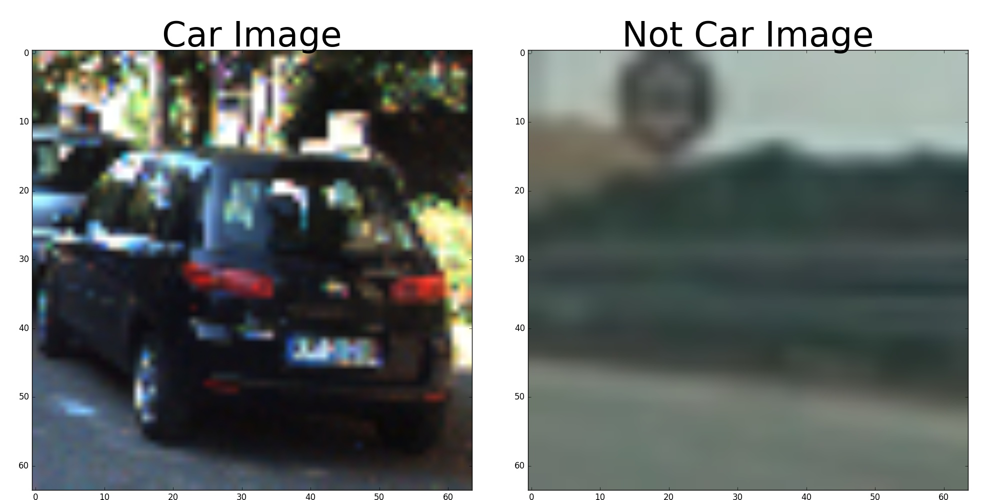
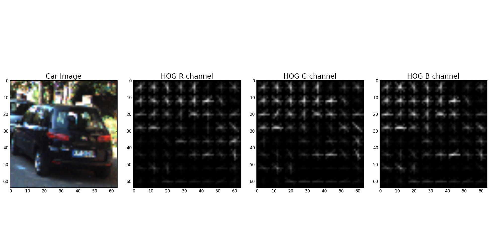
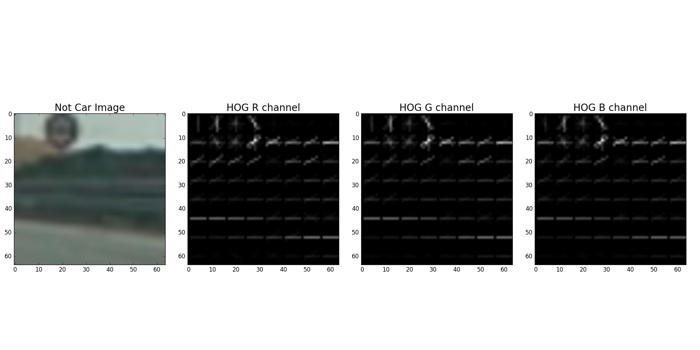
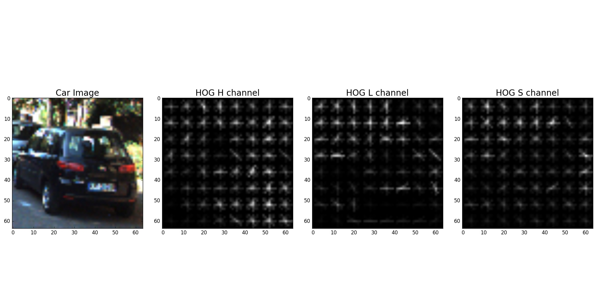
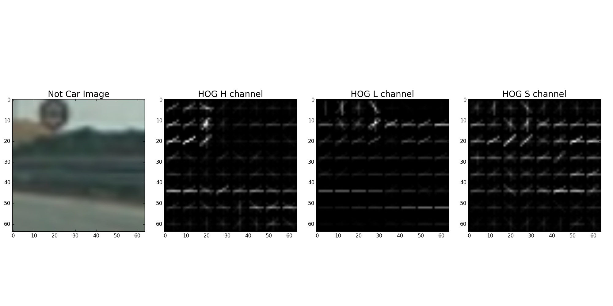
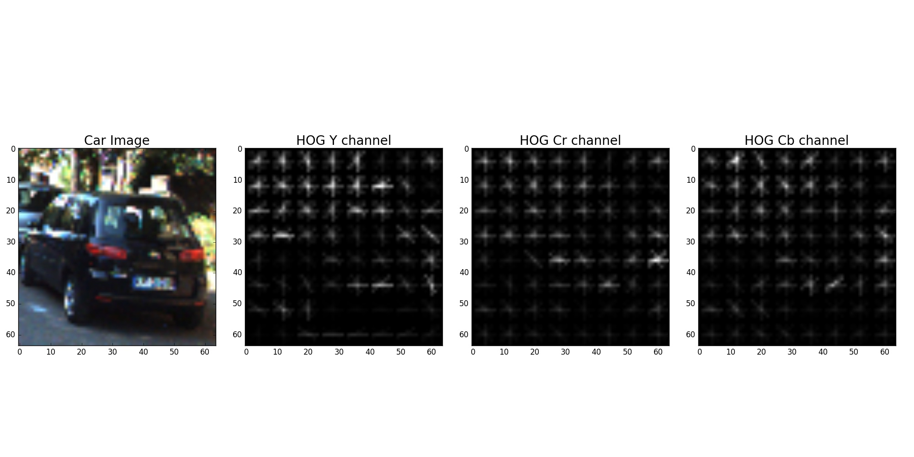
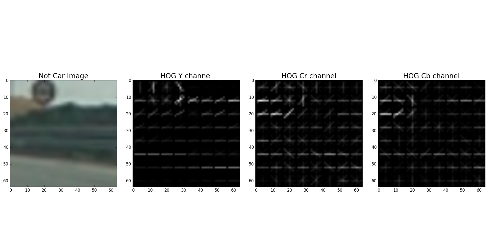
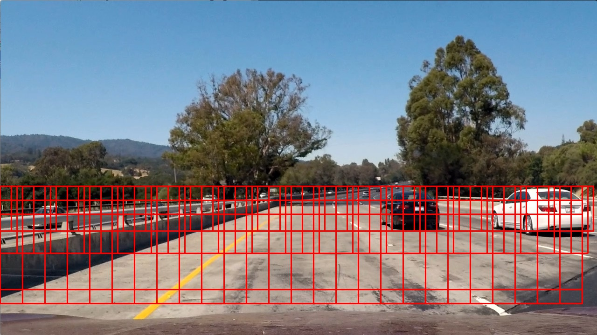
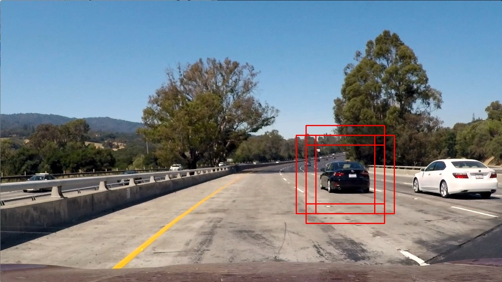
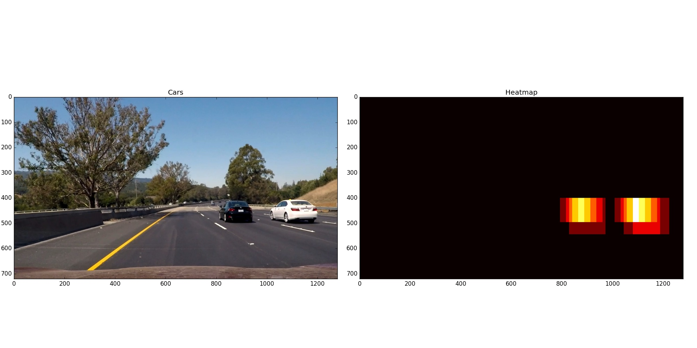

# Vehicle Tracking

## Introduction

The goal of this project is to be able to detect cars in a video stream and draw rectangles around them.

To do that, I first need to build a classifier able to tell what is a car and what is not. Then my algorithm will analyze each frame of the video and draw rectangles around the cars found.

## The Classifier

The classifier I am going to train is an SVM classifier (Support Vector Machine). 

### The Data

The labeled data I am using comes from a combination of the [GTI vehicle image database](http://www.gti.ssr.upm.es/data/Vehicle_database.html) and the [KITTI vision benchmark suite](http://www.cvlibs.net/datasets/kitti/).
The paths to all these images are loaded in the function `load_paths()` (line 15 to 40). All these images are 64x64 pixels. 

In this function I also make sure that I have the same number of car images and non car images to have a balanced dataset (8792 cars and 8792 non cars).

### Creating Feature Vectors

I am not going to feed directly the images to my classifier. Instead I am going to feed it vector of features extracted from these images. These feature vectores are composed of 3 parts:

* Spatial Binning of color features
* Histogram of color features
* Histogram of Oriented Gradient (HOG) features

#### Spatial Binning of color features

The first feature is going to be the raw pixel values of the images. 

Since the frames of the video have high resolution, I need to use spatial binning to be able to extract this feature quickly. I chose to resize the image to 32x32 pixels. Even with this resolution, I can still identify the cars by eye so it is relevant to use this feature with spatial binning to 32x32.

This is done in the function `get_spatial_features` (line 42 to 51).

#### Histogram of color features

Color also helps us detect a car. So the second part of my feature vector is composed of the histogram of pixels from each color channel. I perform these histograms for all 3 color channels and use 32 bins for the histogram.
 
This is done in the function `get_color_features` (line 53 to 59)

#### HOG features

Finally, a car can be detected by its edges, more precisely the profile of orientation of the gradient. So the last part of my feature vector is composed of HOG. the `hog` function from the `skimage` library will compute the gradients from blocks of cells in multiple directions. The parameters I chose are 8 orientations, 8 pixels per cell and 2 cells per block (choice explained later).

This is done in the function `get_hog_features` (line 65 to 78)

#### Combining the features

These 3 features are combined into a single feature vector for each image in the function `get_features` (line 80 to 125).

### Training the classifier

Now that I can get a feature vector for each image in my dataset, I can train my classifier. 

For that, I first scale my feature vectors to have zero mean and a unit variance thanks to the function `StandardScaler()`of the library `sklearn`. 

Then I split the dataset into a training set (70% of the data), a cross-validation set (15% of the data) and a test set (15% of the data).

This is done in the function `prepare_sets` (line 141 to 166).

Finally I train my classifier in the function `fit_svc` (line 168 to 184). I used this function and the cross-validation sets to fine tune the different parameters of my features extraction. This fine tuning is done on the cross-validation set and not the test set to avoid overfitting. The parameters I chose are:

| Parameter                       | Value    | 
|:-------------------------------:|:--------:| 
| color_space                     | YCrCb    | 
| size (for spatial binning)      | (32,32)  |
| nbins (for color histogram)     | 32       |
| orient (for hog)                | 8        |
| pix_per_cell (for hog)          | 8        |
| cell_per_block (for hog)        | 2        |

The color space YCrCb was chosen after trying other color spaces. It is the one that seemed the most dicriminatory to distinguish cars and non cars and it is the one that worked best on the cross validation set.

The accuracy of the classifier on the test set is 99.2%

## Detecting car in an image

Now that my classifier is trained, given an image, it should be able to tell if it is a car or not. 

But it won't work on the picture taken from the dashboard (there are to big and cover an area too big). So, I will slice this picture into smaller images so that the classifier can analyze them and tell if ther is a car or not. To do that I am going to use a sliding window method.

### Sliding window method

I want to slice my frame into smaller images that can be analyzed by my classifier to tell if they contain a car or not. 

To do that I define a list of windows to analyze in the function `slide_window` (line 191 to 231). This function will take a window of size `xy_window` where the first corner is `x_start_stop[0], y_start_stop[0]`. Then it will slide it across the image untill reaching `x_start_stop[1], y_start_stop[1]`. This slide is performed with an overlap of `xy_overlap`.

To be sure to detect all the cars, I am going to use 3 types of windows: windows to detect cars that are far, windows to detect cars that are close and windows to detect cars in between. Since the farther a car is the smaller it appears, the far windows are smaller than the close ones. 

I decided on the sizes of the windows by measuring the cars on the test images. I chose a 75% overlap in both directions through trial and error.

This is done in the function `boxes_to_scan` (line 233 to 240). This function returns the coordinates of the slices of pictures I want to feed my classifier.

### Region of Interest

But these are not the only slices of pictures I am going to feed my classifier. Indeed, if I used only these slices, I would either find a lot of false positive or fail to detect cars.

So, if I found a car in the previous frame, I am also going to define slices of the pictures around the position of the car in the previous frame.

This is done in the function `add_boxes_around` (line 291 to 317). This function takes in input the box where I found the car in the previous frame and outputs 5 boxes arround that position where I should look for a car in this frame.

### Heatmap

Now that I have all the slices of the picture I want to analyze, I can extract feature vectors from them and pass them to the classifier. The classifier will label them 1 if it found a car and 0 otherwise. By adding all the coordinates of the slices of images wher the classifier found a car, I obtain a heatmap.

This is done in the function `add_heat` (line 242 to 254).

Then, the more heat there is, the greater the probability that there is a car in this region. So, by thresholding this heatmap, I can choose only the regions where the probability of a car is high. This allows me to dismiss false positive.

This is done in the function `apply_threshold` (line 256 to 263).

Moreover, I am going to keep the heatmaps in memory. Indeed, to avoid false positive, I am going to combine previous heatmaps so that I draw a box only if a car is found in multiple consecutive frames.

### Drawing the boxes around the cars

Finally, once I have my thresholded heatmap, I use the function `label`of the `scipy.ndimage.measurements` library to define the areas around which I need to draw the boxes. Then I simply draw rectangular boxes around those areas.

This is done in the function `draw_boxes` (line 284 to 289).

## The Final Pipeline

Finally, I can analyze the video frame by frame thanks to the `process_image`function (line 319 to 373):

* I define the windows to analyze thanks to the sliding window method
* I add windows around the position where I found cars in the previous frame
* I resize each window to 64x64 pixels
* I extract a feature vector from this image
* I feed this vector to the classifier
* If the classifier says it is a car, I add this window to the heatmap
* I add the heatmap of this picture to the previous heatmaps
* I threshold the final heatmap
* I define the areas around which I want to draw the boxes
* I draw the boxes
* I update my parameters (the new region of interest to use and the new list of previous heatmaps to use)
* I return the frame with the boxes drawn and the new parameters to use in the next frame

The parameters `nb_previous` (number of previous heatmaps to use) and `threshold` have been determined by trial and error.

<video controls>
  <source src="project_video_out.mp4" type="video/mp4">
</video> 

## Discussion

This algorithm depends on a lot of parameters, so the results might not be as good on different videos. The pipeline will also fail to detect other vehicles such as motocycle or trucks. The next step would be to train other classifier to recognize these vehicles and pedestrians. 

Also, the boxes arround the car are a bit jittery. I could try to average them over multiple frame so that the results appears more smoothly.

Another default of the algorithm is that it cannot separate 2 cars when they are close from one another. This should be improved.

Finally I will combine this pipeline with the Lane Finding one to have a more complete result.

